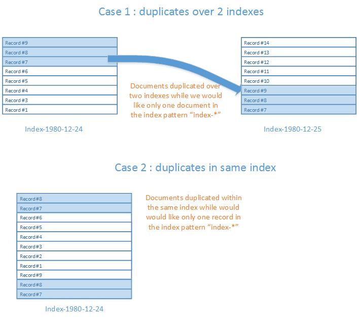
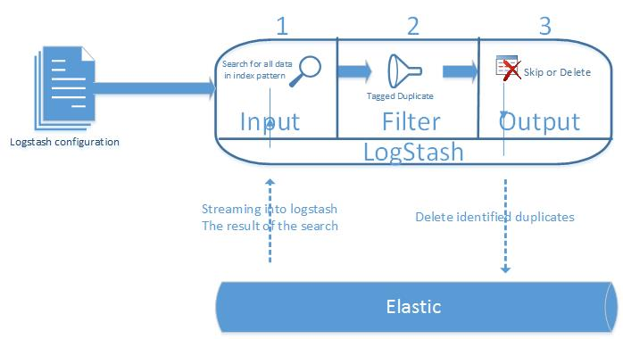

# How to delete duplicate records in elasticsearch using logstash

There is no point here to give a recommendation on how to do thing or why have we ended up with duplicate. This sample explain that logstash can be used beyond just ingesting data.

## the case 

we have an index whose pattern is `blueprism.process.completed-*`, for whatever reason we have loaded the data multiple times, this can happened in different scenario but two of classic can be like :

- you keep inserting records without using the option `doc_as_upsert => "true"` and without having properly set `document_id`. if `document_id` is not set, elastic will generate a unique document id for each record inserted. 
- your index is of the form `${indexname}-{YYY.MM.DD}', it means that everyday you ingest data, it is stored in the index of the day regardless of any record that exists already that may be a duplicate.

To make sure documents are uniquely identified in the construct at ingesting time, you can set the key of your choice by setting `document_id`. then to avoid duplicates you can mention the option `doc_as_upsert => "true"`.

<p align="center">

</p>


### Remark : `doc_as_upsert`
there is an option in elastic preventing duplicates in same index but this does not work at the index pattern level.
setting `doc_as_upsert => "true"` will avoid duplicates document based on `docuemnt_id` :

```
output {
    elasticsearch { 
	hosts => "http://${ELKMASTERHOSTNAME}:${ELKMASTERPORT}"
	index => "%{type}-%{+YYYY.MM.dd}"
	document_id => "%{sessionnumber}-%{seqnum}"
	doc_as_upsert => "true"
    }
```

## Leveraging `logstash` to remove duplicates

The Process is pretty straight forward:

* Define a configuration containing the whole process definition for logstash to work
* Load logstash with the configuration file
* Wait until completion

The process does :

1. define as input elastisearch
2. at the same time query the data that needs to be cleaned up. Important to notice that the search query will sort the records in  way duplicates will be next to each other without anything in between.
3. In the filter section, as the filter will receive a stream of ordered records per document id, it is just a matter to keep the previous record id in a variable and when reading the next record, it is just a matter to compare previous with current and if they are same, just tag the current to be deleted. 
4. As output the task is only to delete any record that has been tagged to be deleted.


<p align="center">

</p>


## Logstash configuration

### Input

in the input phase we are querying elstic to stream the data in. The query is quite straight forward however there is an important consideration : the records need to be sorted per their key in order to the process to work further in the filter and output stage.


```
elasticsearch {
	hosts => "http://${ELKMASTERHOSTNAME}:${ELKMASTERPORT}"
	index => "blueprism.process.completed-*"
	docinfo => true
	query => '{
  "query": {
    "match_all": { }
  },
  "sort": [ 
    {
      "sessionnumber": {
        "order": "asc"
      }
    },
   {
      "seqnum": {
        "order": "asc"
      }
    },
    {
      "_index": {
        "order": "asc"
      }
    }
  ]
}'
}
```


### Filter

Feature being used :
* Ruby code to track as we progressed filtering the records that may have same key s the record already scanned. Notice the `init` portion of the code and the loop portion in `code'. 
* Tag feature to help the output engine to delete all the records tagged as duplicates


```
filter {
ruby
{
			init => "@@sessionnumber = -1; @@Seqnum = -1"
			code => 'if event.get("sessionnumber") == @@sessionnumber && event.get("seqnum") == @@seqnum
event.set("TAGDELETE","TRUE")
else
@@sessionnumber = event.get("sessionnumber"); @@seqnum = event.get("seqnum")
end
'
}
```


### Output

the magic has happened in the filter big tagging the records that should be deleted. The output stage is just the physical delete of the duplicates records. Features being used :

* delete records in elastic based on its id
* use of metadata reference

```
output {
if [TAGDELETE] == "TRUE"
{
 elasticsearch { 
	action => "delete"
	hosts => "http://${ELKMASTERHOSTNAME}:${ELKMASTERPORT}"
	index => "%{[@metadata][_index]}"
	document_type => "%{[@metadata][_type]}"
	document_id => "%{[@metadata][_id]}"
    }
  stdout { codec => rubydebug }

}
# display to the console any of the output stream, this can be commented for performance reason
 # stdout { codec => rubydebug }
}
```