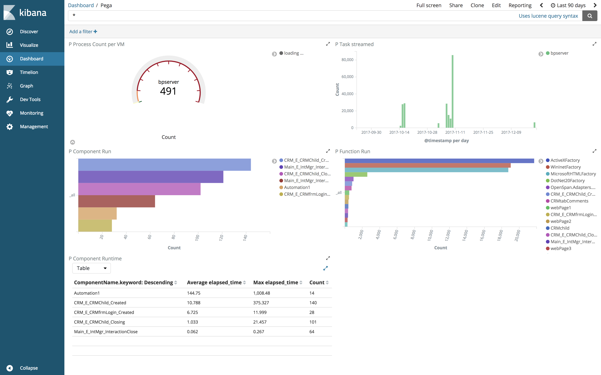

---
Title | Author | Date 
---|---|---
OpenSpan integration |Rumi | ** April 2018**
---
# Background

The genesis of this use case happened during a demo of the capability of Elastic in the context of Robotic Process Automation for Blueprism. The group was very interested in exploring whether such capability could be deployed with their own RDA/RPA tool : OpenSpan. The challenge was addressed overnight. The team expressed some doubt about the ease of doing same for OpenSpan as for BluePrism, people were highlighting the lack of logs and data. Being in IT for quite some time, I have very little  doubt about the ability of modern softwares to generate a lot of data even though sometime I am suprise about the way it is done. I took the challenge and for me it was not about doing it eventually, it was about doing it fast, having something done the next day morning was the whole point!

I must admit the most challenging part was to install and learn OpenSpan overnight, go through the tutorial and build a valid use case to generate enough data to demonstrate the concept. The last part was to explore how technically the data is produced and what can be done with it in elastic. 

# The Logs

To my surprise, OpenSpan was generating a huge amount of data even in the context of RDA which in nature is not a server based application. The flexibility while building the bot to create, generate additional logs was highlily flexible, which for a demo add to the complexity of building something fast and relevant. This is why I integrated two log files, one that I enable myself in OpenSpan ([CRM_E_CRMfrmLogin_Created.log](./CRM_E_CRMfrmLogin_Created.log)) and the other one that exist in OpenSpan ([RuntimeLog.txt](./RuntimeLog.txt)).

> Note : in this example only `RuntimeLog.txt` has been used but you may want to look at OpenSpan logs confirmation in greater details [:eye:here](./OpenSpan-logs.md)

> OpenSpan is only running on windows, by default the logs are located under `C:\Users\<user>\AppData\Roaming\OpenSpan\`
> The configuration of the standard logs in openspan is very similar to `log4j', it can be configured at runtime. 

# The `Runtime` file 

If you like regular expression and scripting, this is for you. In this example we will explore how a pipeline in logstash can do some cool thing like compute duration of task based on logging entries based on pattern : 1 line for start with time stam and 1 line for end with time stamp.

List of features used in this example :

- CSV plugin to map the raw data into comprehensive field for building json document
- Elapsed plugin to compute duration of task being tracked by being and start records
- Date plugin to create a timestamp field from a date/time text
- Ruby scripting, this will allow to capture a once off date that will be needed to be amalgamate with the time stamp of each record to contruct a full time stamp : Date + Time.

# The Dashboard

# `Filebeat` implementation
- [:eyes: OpenSpan RDA - Filebeat implementation](./OpenSpan-filebeat.md)
