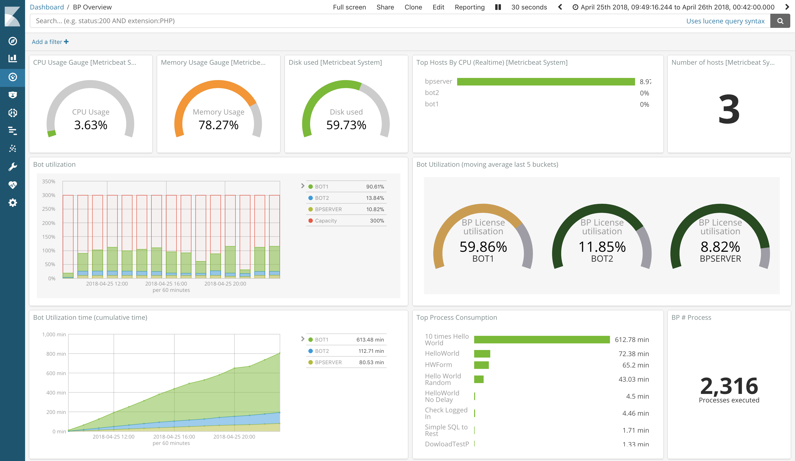
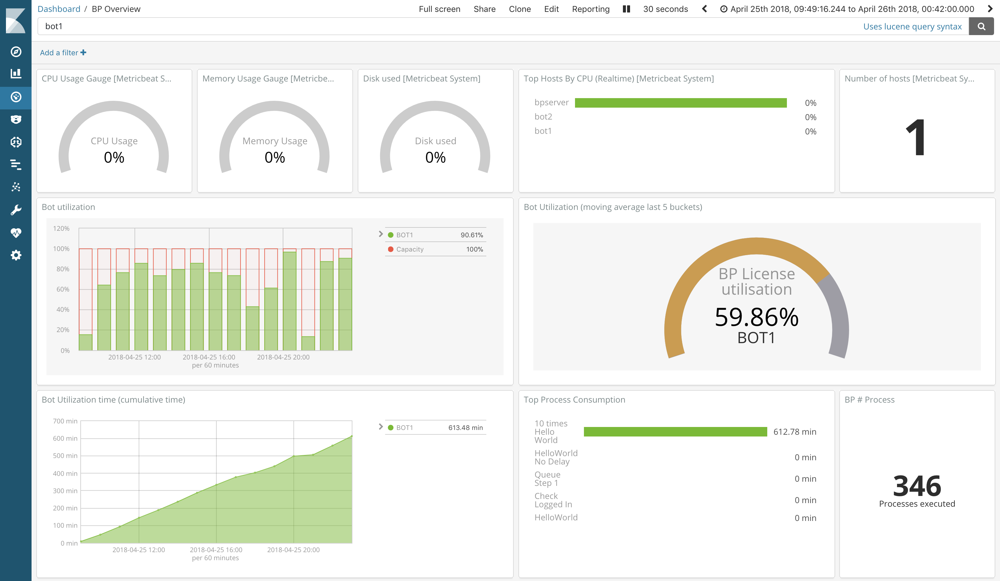

# Effective measure of bot consumption

## Business problem definition

1. In order to measure the effectiveness of the bot utilization, we need to provide how effective is the usage of *blueprism* licenses. In other words, is there any time where the machine is not doing anything?
2. In addition to the effectiveness of the bot license utilization, we would like to measure how effective is the utilization of the infrastructure running the bots. In this document we will only cover the cpu, memory and disk; however it could be pushed to any kind of resource attached to the eco-systems.

## Approach

Combining the data from *metricbeat* and *blueprism* can provide lots of insights such as:

This dashboard provides a macro view of what is going on with regards to blueprism as well as all the VM running underneath. This is where the fun start, the same dashboard that is used as macro view can be easily focusing on one particular machine by leveraging the built-in capabilities of kibana/elastic such as :

