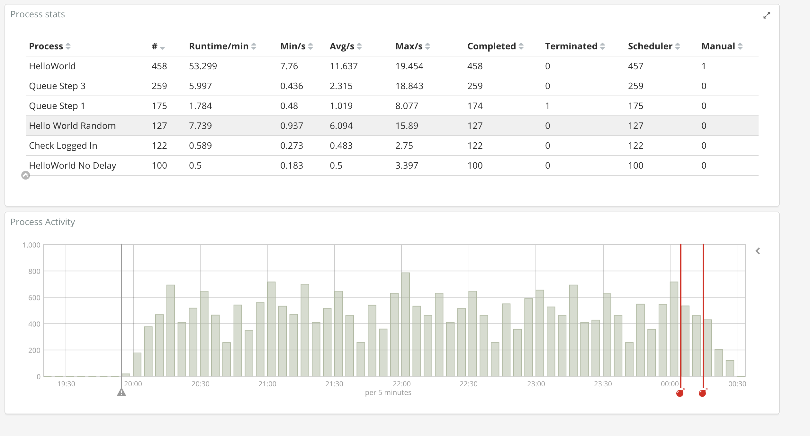
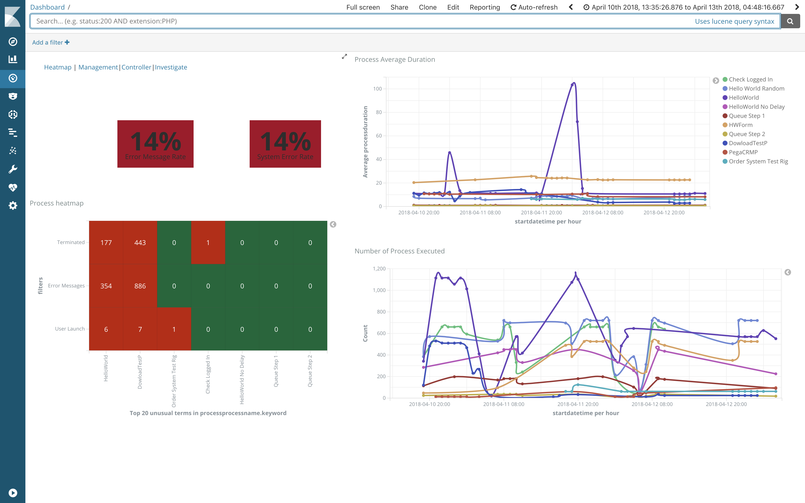
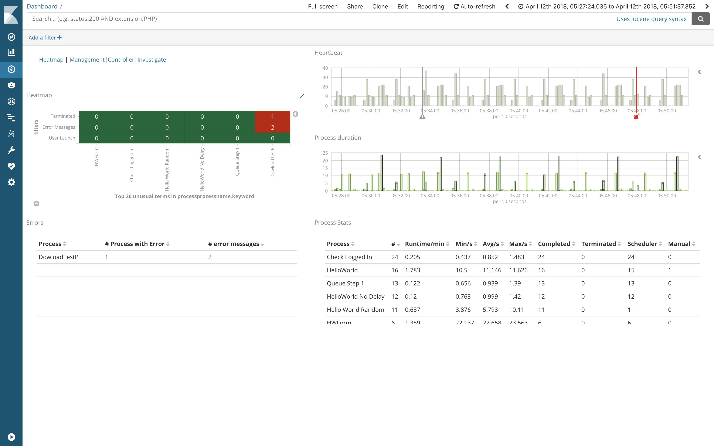
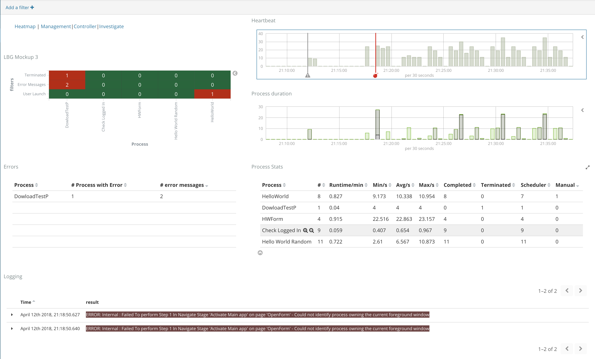
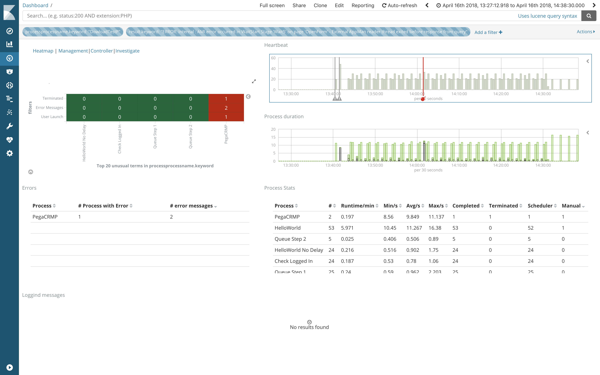

# Background

This use case was about building dashboard and monitoring for blueprism in addition to the control room and logging capability in Blueprism.

## Final product

The final product is made of 5 dashboards :

- Simplify Dashboard



- Heatmap


- Management Dashboard



- Controller dashboard



- Investigation dashboard



- Alerting

Each time a error happens (like the  :bomb:), an alert is generated using the watcher and email action.




## Features

- Vega Visualization
- Visual builder including annotation
- Kibana visualization including scripting features


Watcher code looks like 

```
{
    "trigger": {
        "schedule": {
            "cron": "0 0/1 * * * ?"
        }
    },
    "input": {
        "search": {
            "request": {
                "indices": [
                    "blueprism.process.completed*"
                ],
                "body": {
                    "size": 1,
                    "query": {
                        "bool": {
                            "must": [
                                {
                                    "term": {
                                        "status": "terminated"
                                    }
                                },
                                {
                                    "range": {
                                        "@timestamp": {
                                            "gt": "now-5m"
                                        }
                                    }
                                }
                            ]
                        }
                    }
                }
            }
        }
    },
    "condition": {
        "compare": {
            "ctx.payload.hits.total": {
                "gte": 1
            }
        }
    },
    "throttle_period": "15m",
    "actions": {
        "send_email": {
            "email": {
                "to": "<name>@<corporation>",
                "subject": "Watcher Notification Encountered {{ctx.payload.hits.total}} errors",
                "body": "{{ctx.payload.hits.total}} error logs found",
                "attachments": {
                    "attached_data.json": {
                        "data": {
                            "format": "json"
                        }
                    }
                }
            }
        }
    }
}
```

Elasticsearch.yml configuration for watcher

```
#xpack.watcher.enabled: true
#xpack.notification.email.account:
#    gmail_account:
#        profile: gmail
#        smtp:
#            auth: true
#            starttls.enable: true
#            host: smtp.gmail.com
#            port: 587
#            user: '<gmailaccount>@gmail.com'
#            password: '<to be generated>'

# Make sure that once the message was generated, it will not for another 5 min. 
# xpack.watcher.execution.default_throttle_period: 5m

```

Vega Visualization looks like
=====
```
{
  "$schema": "https://vega.github.io/schema/vega/v3.json",
  "signals": [
    {"name": "layout", "value": "squarify", "bind": {"input": "select", "options": ["squarify", "binary", "slicedice"]}},
    {"name": "aspectRatio", "value": 1.6, "bind": {"input": "range", "min": 0.2, "max": 5, "step": 0.1}}
  ],
  "data": [
    {
      "name": "tree",
      "url": {
        "%context%": true,
        "%timefield%": "startdatetime",
        "index": "blueprism.process.completed*",
        "body": {
          "size": 0,
          "aggs": {
            "process": {
              "terms": {"field": "processprocessname.keyword"},
              "aggs": {
                "seqnum": {
                  "filter": {"term": {"seqnum": 1}},
                  "aggregations": {"the_count": {"value_count": {"field": "seqnum"}}}
                },
                "error": {
                  "filter": {
                    "query_string": {"analyze_wildcard": true, "default_field": "*", "query": "result:\"?ERROR*\""}
                  },
                  "aggregations": {"the_count": {"value_count": {"field": "result.keyword"}}}
                }
              }
            }
          }
        }
      },
      "format": {"type": "json", "property": "aggregations.process.buckets"},
      "transform": [
        {"type": "formula", "as": "parent", "expr": "1"},
        {"type": "formula", "as": "depth", "expr": "2"},
        {"type": "formula", "as": "size", "expr": "datum.doc_count"},
        {"type": "formula", "as": "severity", "expr": "datum.error.doc_count/datum.doc_count"},
        {"type": "formula", "as": "name", "expr": "datum.key"},
        {
          "type": "impute",
          "key": "id",
          "keyvals": [1],
          "field": "name",
          "method": "value",
          "value": "Root Record for stratify"
        },
        {"type": "stratify", "key": "id", "parentKey": "parent"},
        {
          "type": "treemap",
          "field": "size",
          "sort": {"field": "value"},
          "round": true,
          "method": {"signal": "layout"},
          "ratio": {"signal": "aspectRatio"},
          "size": [{"signal": "width"}, {"signal": "height"}]
        }
      ]
    },
    {"name": "nodes", "source": "tree", "transform": [{"type": "filter", "expr": "datum.children"}]},
    {"name": "leaves", "source": "tree", "transform": [{"type": "filter", "expr": "!datum.children"}]}
  ],
  "scales": [
    {
      "name": "color",
      "type": "ordinal",
      "range": [
        "#3182bd",
        "#6baed6",
        "#9ecae1",
        "#c6dbef",
        "#e6550d",
        "#fd8d3c",
        "#fdae6b",
        "#fdd0a2",
        "#31a354",
        "#74c476",
        "#a1d99b",
        "#c7e9c0",
        "#756bb1",
        "#9e9ac8",
        "#bcbddc",
        "#dadaeb",
        "#636363",
        "#969696",
        "#bdbdbd",
        "#d9d9d9"
      ]
    },
    {"name": "size", "type": "ordinal", "domain": [0, 1, 2, 3], "range": [20, 20, 20, 14]},
    {"name": "opacity", "type": "ordinal", "domain": [0, 1, 2, 3], "range": [0.15, 0.5, 0.8, 1]}
  ],
  "marks": [
    {
      "type": "rect",
      "from": {"data": "leaves"},
      "interactive": false,
      "encode": {
        "enter": {
          "fill": {"scale": "color", "field": "severity"},
          "fillOpacity": {"scale": "opacity", "field": "error.doc_count"}
        },
        "update": {"x": {"field": "x0"}, "y": {"field": "y0"}, "x2": {"field": "x1"}, "y2": {"field": "y1"}}
      }
    },
    {
      "type": "rect",
      "from": {"data": "leaves"},
      "encode": {
        "enter": {"stroke": {"value": "#fff"}},
        "update": {
          "x": {"field": "x0"},
          "y": {"field": "y0"},
          "x2": {"field": "x1"},
          "y2": {"field": "y1"},
          "fill": {"value": "transparent"}
        },
        "hover": {"fill": {"value": "green"}}
      }
    },
    {
      "type": "text",
      "from": {"data": "leaves"},
      "interactive": false,
      "encode": {
        "enter": {
          "font": {"value": "Comic Sans MS"},
          "align": {"value": "center"},
          "baseline": {"value": "middle"},
          "fill": {"value": "#000"},
          "text": {"field": "name"},
          "fontSize": {"scale": "size", "field": "depth"},
          "fillOpacity": {"scale": "opacity", "field": "depth"}
        },
        "update": {"x": {"signal": "0.5 * (datum.x0 + datum.x1)"}, "y": {"signal": "0.5 * (datum.y0 + datum.y1)"}}
      }
    }
  ]
}
```


Interesting scripting samples
======
