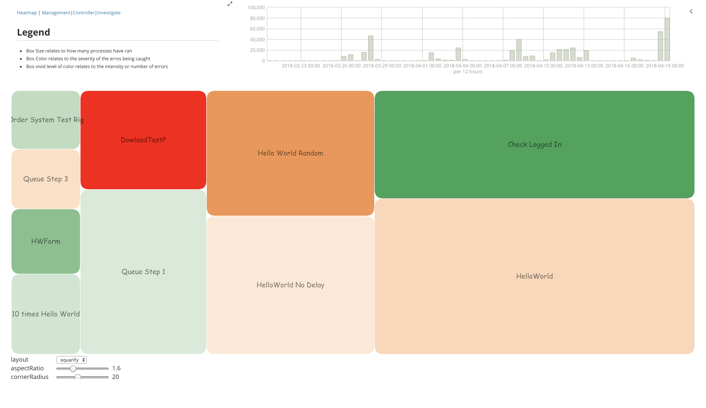
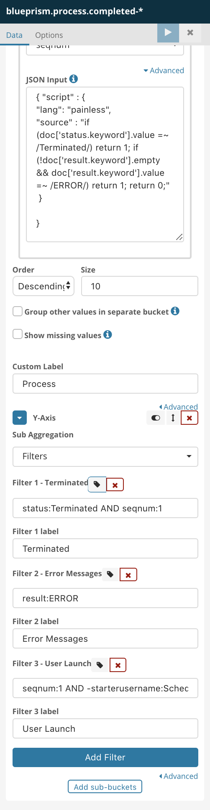
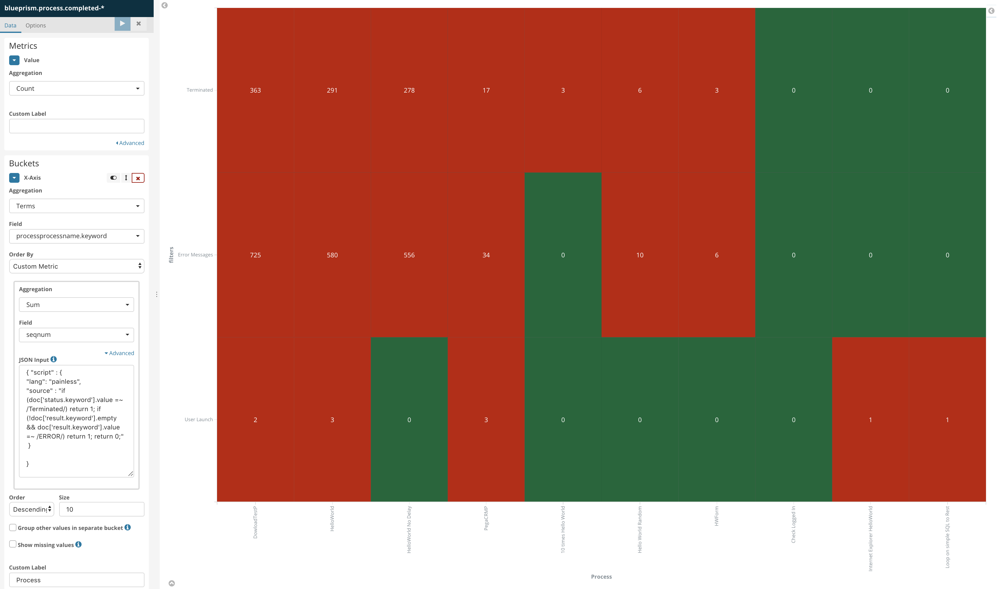

---
Title | Author | Date 
---|---|---
blueprism Management Dashboard | Rumi | ** April 2018**
---


<!-- TOC -->

- [Background](#background)
    - [Final product](#final-product)
    - [Features](#features)
        - [Watcher](#watcher)
        - [Vega Visualization](#vega-visualization)
        - [Standard Kibana Visualization](#standard-kibana-visualization)
            - [Heatmap](#heatmap)
        - [Extended feature : bot utilization](#extended-feature--bot-utilization)

<!-- /TOC -->

# Background

This use case was about building dashboard and monitoring for blueprism in addition to the control room and logging capability in Blueprism.

## Final product

The final product is made of 5 dashboards :

- Simplify Dashboard


- Heatmap



- Management Dashboard


- Controller dashboard


- Investigation dashboard


- Alerting

Each time a error happens (like the  :bomb:), an alert is generated using the watcher and email action.


## Features

- Vega Visualization
- Visual builder including annotation
- Kibana visualization including scripting features

### Watcher

Watcher code looks like 

```
{
    "trigger": {
        "schedule": {
            "cron": "0 0/1 * * * ?"
        }
    },
    "input": {
        "search": {
            "request": {
                "indices": [
                    "blueprism.process.completed*"
                ],
                "body": {
                    "size": 1,
                    "query": {
                        "bool": {
                            "must": [
                                {
                                    "term": {
                                        "status": "terminated"
                                    }
                                },
                                {
                                    "range": {
                                        "@timestamp": {
                                            "gt": "now-5m"
                                        }
                                    }
                                }
                            ]
                        }
                    }
                }
            }
        }
    },
    "condition": {
        "compare": {
            "ctx.payload.hits.total": {
                "gte": 1
            }
        }
    },
    "throttle_period": "15m",
    "actions": {
        "send_email": {
            "email": {
                "to": "<name>@<corporation>",
                "subject": "Watcher Notification Encountered {{ctx.payload.hits.total}} errors",
                "body": "{{ctx.payload.hits.total}} error logs found",
                "attachments": {
                    "attached_data.json": {
                        "data": {
                            "format": "json"
                        }
                    }
                }
            }
        }
    }
}
```

Elasticsearch.yml configuration for watcher

```
#xpack.watcher.enabled: true
#xpack.notification.email.account:
#    gmail_account:
#        profile: gmail
#        smtp:
#            auth: true
#            starttls.enable: true
#            host: smtp.gmail.com
#            port: 587
#            user: '<gmailaccount>@gmail.com'
#            password: '<to be generated>'

# Make sure that once the message was generated, it will not for another 5 min. 
# xpack.watcher.execution.default_throttle_period: 5m

```


### Vega Visualization

Code for heatmap :

```
{
  "$schema": "https://vega.github.io/schema/vega/v3.json",
  "padding": {"bottom": 50},
  "signals": [
    {
      "name": "layout",
      "value": "squarify",
      "bind": {
        "input": "select",
        "options": ["squarify", "binary", "slicedice"]
      }
    },
    {
      "name": "aspectRatio",
      "value": 1.6,
      "bind": {"input": "range", "min": 0.2, "max": 5, "step": 0.1}
    },
    {
      "name": "cornerRadius",
      "value": 20,
      "bind": {"input": "range", "min": 0, "max": 50, "step": 1}
    }
  ],
  "data": [
    {
      "name": "tree",
      "url": {
        "%context%": true,
        "%timefield%": "startdatetime",
        "index": "blueprism.process.completed*",
        "body": {
          "size": 0,
          "aggs": {
            "process": {
              "terms": {"field": "processprocessname.keyword"},
              "aggs": {
                "seqnum": {
                  "filter": {"term": {"seqnum": 1}},
                  "aggregations": {
                    "the_count": {"value_count": {"field": "seqnum"}}
                  }
                },
                "error": {
                  "filter": {
                    "query_string": {
                      "analyze_wildcard": true,
                      "default_field": "*",
                      "query": "result:\"?ERROR*\""
                    }
                  },
                  "aggs": {
                    "Process_On_Error_count": {
                      "cardinality": {"field": "sessionnumber"}
                    }
                  }
                },
                "Terminated": {
                  "filter": {
                    "query_string": {
                      "fields": ["status"],
                      "query": "status:Terminated"
                    }
                  },
                  "aggs": {
                    "Terminated_count": {
                      "cardinality": {"field": "sessionnumber"}
                    }
                  }
                }
              }
            }
          }
        }
      },
      "format": {"type": "json", "property": "aggregations.process.buckets"},
      "transform": [
        {"type": "formula", "as": "parent", "expr": "1"},
        {"type": "formula", "as": "depth", "expr": "2"},
        {"type": "formula", "as": "size", "expr": "datum.seqnum.doc_count"},
        {
          "type": "formula",
          "as": "severity",
          "expr": "min(19*(datum.Terminated.Terminated_count.value/datum.seqnum.doc_count)+5*(datum.error.Process_On_Error_count.value/datum.seqnum.doc_count),19)"
        },
        {
          "type": "formula",
          "as": "density",
          "expr": "min((datum.Terminated.Terminated_count.value/datum.seqnum.doc_count)+(datum.error.doc_count/datum.seqnum.doc_count),20)"
        },
        {"type": "formula", "as": "name", "expr": "datum.key"},
        {
          "type": "impute",
          "key": "id",
          "keyvals": [1],
          "field": "name",
          "method": "value",
          "value": "Root Record for stratify"
        },
        {"type": "stratify", "key": "id", "parentKey": "parent"},
        {
          "type": "treemap",
          "field": "size",
          "sort": {"field": "value"},
          "round": true,
          "method": {"signal": "layout"},
          "ratio": {"signal": "aspectRatio"},
          "size": [{"signal": "width"}, {"signal": "height"}]
        }
      ]
    },
    {
      "name": "nodes",
      "source": "tree",
      "transform": [{"type": "filter", "expr": "datum.children"}]
    },
    {
      "name": "leaves",
      "source": "tree",
      "transform": [{"type": "filter", "expr": "!datum.children"}]
    }
  ],
  "scales": [
    {
      "name": "color",
      "type": "sequential",
      "domain": [0, 19],
      "clamp": true,
      "range": [
        "#31a354",
        "#fee4cd",
        "#fdc99b",
        "#fdae6b",
        "#fca04f",
        "#fc851d",
        "#e26b03",
        "#b05303",
        "#7e3c02",
        "#fdae6b",
        "#ffcccc",
        "#ffcccc",
        "#ff9999",
        "#ff9999",
        "#ff6666",
        "#ff6666",
        "#ff3333",
        "#ff3333",
        "#ff0000",
        "#ff0000"
      ]
    },
    {
      "name": "size",
      "type": "ordinal",
      "domain": [0, 1, 2, 3],
      "range": [14, 16, 20, 28]
    },
    {
      "name": "opacity",
      "type": "ordinal",
      "domain": [0, 1, 2, 3],
      "range": [0.3, 0.5, 0.8, 1]
    }
  ],
  "marks": [
    {
      "type": "rect",
      "from": {"data": "leaves"},
      "interactive": false,
      "encode": {
        "enter": {
          "fill": {"scale": "color", "field": "severity"},
          "fillOpacity": {"scale": "opacity", "field": "density"}
        },
        "update": {
          "x": {"field": "x0"},
          "y": {"field": "y0"},
          "x2": {"field": "x1"},
          "y2": {"field": "y1"},
          "cornerRadius": {"signal": "cornerRadius"}
        }
      }
    },
    {
      "type": "rect",
      "from": {"data": "leaves"},
      "encode": {
        "enter": {"stroke": {"value": "#fff"}, "cornerRadius": 10},
        "update": {
          "x": {"field": "x0"},
          "y": {"field": "y0"},
          "x2": {"field": "x1"},
          "y2": {"field": "y1"},
          "fill": {"value": "transparent"},
          "cornerRadius": {"signal": "cornerRadius"}
        },
        "hover": {"fill": {"value": "green"}}
      }
    },
    {
      "type": "text",
      "from": {"data": "leaves"},
      "interactive": false,
      "encode": {
        "enter": {
          "font": {"value": "Comic Sans MS"},
          "align": {"value": "center"},
          "baseline": {"value": "middle"},
          "fill": {"value": "#000"},
          "text": {"field": "name"},
          "fontSize": {"scale": "size", "field": "depth"},
          "fillOpacity": {"scale": "opacity", "field": "depth"}
        },
        "update": {
          "x": {"signal": "0.5 * (datum.x0 + datum.x1)"},
          "y": {"signal": "0.5 * (datum.y0 + datum.y1)"}
        }
      }
    }
  ]
}
```


### Standard Kibana Visualization

#### Heatmap

Features implemented in the heatmap are :

- highlight the number of processes that have been terminated in blueprism rather than completed.
- highlight the number of error messages encountered for each process
- Highlight whenever a process is ran manually
- Finally sort the heatmap in a way that the top process with the most problem are listed first. This will avoid if we have more than 10 process that the system will pick and chose the wrong one or just sort by the name of the process. In this case we would like to give a weight to the process having errors and sort using that weight. The magic is described in the pictures here below.

<p float="left">

</p>

### Extended feature : bot utilization
- [:eyes:here bot utilization](./BotConsumption.md)
- [:eyes:here Vega Tutorial](./vega/vega-tutorial.md)

### Configuration

All configuration is stored [here](./config)