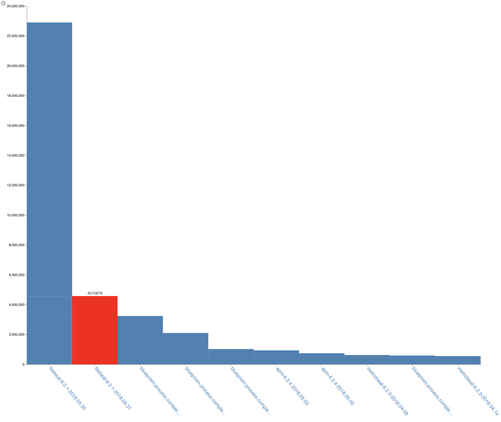
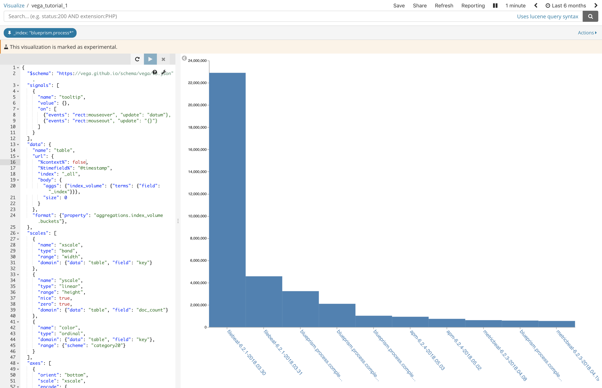
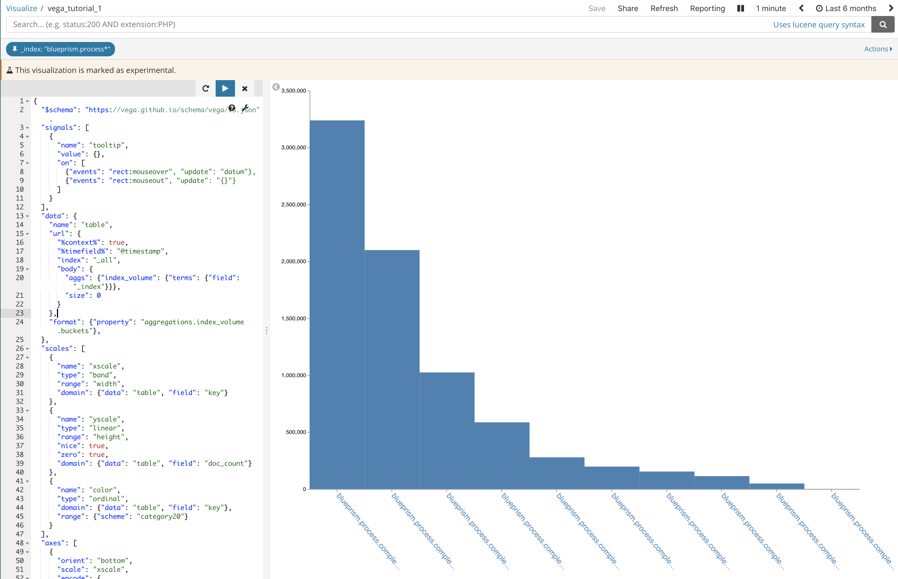

# Vega tutorial : understanding how to navigate the data

## Use case

let's try to build a bar chart that reports the number of document per indices as follow :



## Understanding how to navigate the json

In vega the data can be in excel, in json or it can even be the result to a call to a rest api. In our case we will explain how to get data in `kibana` vega container from `elasticsesarch` aggregation engine.

In order to get the number of document per elasticsearch indice, let's run the following query

```javascript
# let's consider the following query where we try to get the number of document per index
GET _all/_search
{"size": 0,
  "aggs": {
    "index_volume": {
      "terms": {
        "field": "_index"
      }
    }
  }
}
```

here is the output 

```javascript
{
  "took": 476,
  "timed_out": false,
  "num_reduce_phases": 3,
  "_shards": {
    "total": 1437,
    "successful": 1437,
    "skipped": 0,
    "failed": 0
  },
  "hits": {
    "total": 88586961,
    "max_score": 0,
    "hits": []
  },
  "aggregations": {
    "index_volume": {
      "doc_count_error_upper_bound": 1,
      "sum_other_doc_count": 30892271,
      "buckets": [
        {
          "key": "filebeat-6.2.1-2018.03.30",
          "doc_count": 22900000
        },
        {
          "key": "logstash-2016.04.10",
          "doc_count": 9076007
        },
        {
          "key": "filebeat-6.2.1-2018.03.31",
          "doc_count": 4575878
        },
        {
          "key": "logstash-2016.05.12",
          "doc_count": 4371055
        },
        {
          "key": "logstash-2016.04.03",
          "doc_count": 4313369
        },
        {
          "key": "logstash-2016.03.27",
          "doc_count": 3851443
        },
        {
          "key": "blueprism.process.completed-2017-09",
          "doc_count": 3238544
        },
        {
          "key": "blueprism.process.completed-2017-10",
          "doc_count": 2099330
        },
        {
          "key": ".monitoring-es-6-2018.04.22",
          "doc_count": 1713353
        },
        {
          "key": "logstash-2016.03.29",
          "doc_count": 1555711
        }
      ]
    }
  }
}
```

### Defining the path where the data set is stored

When looking at the example above, we can define the output the following way :

```javascript
{
 { /* information on query execution */}
 
  "aggregations": {
    "index_volume": {
      "buckets": [
        // array containing the result set, each element of the result set looks like :
        // {
        // "key": <name of indice>,
        //  "doc_count": <numnber of document> 
        // }
      ]
    }
  }
}
```

from there if ww would like to access the element of the result set, we need to indicate to vega the path to the result set the following way :

```javascript
"format": {"property": "aggregations.index_volume.buckets"}
```

### Linking `kibana` context to the visualization

This is perhaps where the value of elastic aggregation syntax gets very powerful. Lots of people found the syntax very difficult, however this allow managing pipeline very well. In other words, it is easy for `kibana` to add the context (e.g. time range filter) to refine the visualization to the context being setup. this is done the following way :

```javascript
"data": {
    "name": "table", // define the name of the data set for further reference in vega toolkit
    "url": {
      "%context%": false, // will apply any dashboard filter when set to true
      "%timefield%": "@timestamp", // will link the relationship between the kibana time filter and the aggregation filter
      "index": "_all",
      "body": {
        "aggs": {"index_volume": {"terms": {"field": "_index"}}},
        "size": 0
      }
    },
    "format": {"property": "aggregations.index_volume.buckets"},
  },

```


#### `%context% : false | true`

Here are two examples showing the impact of `%context%` setting, when it is false the filter on `_index` is not considered while when it is true it is.

<p float="left">


</p>
