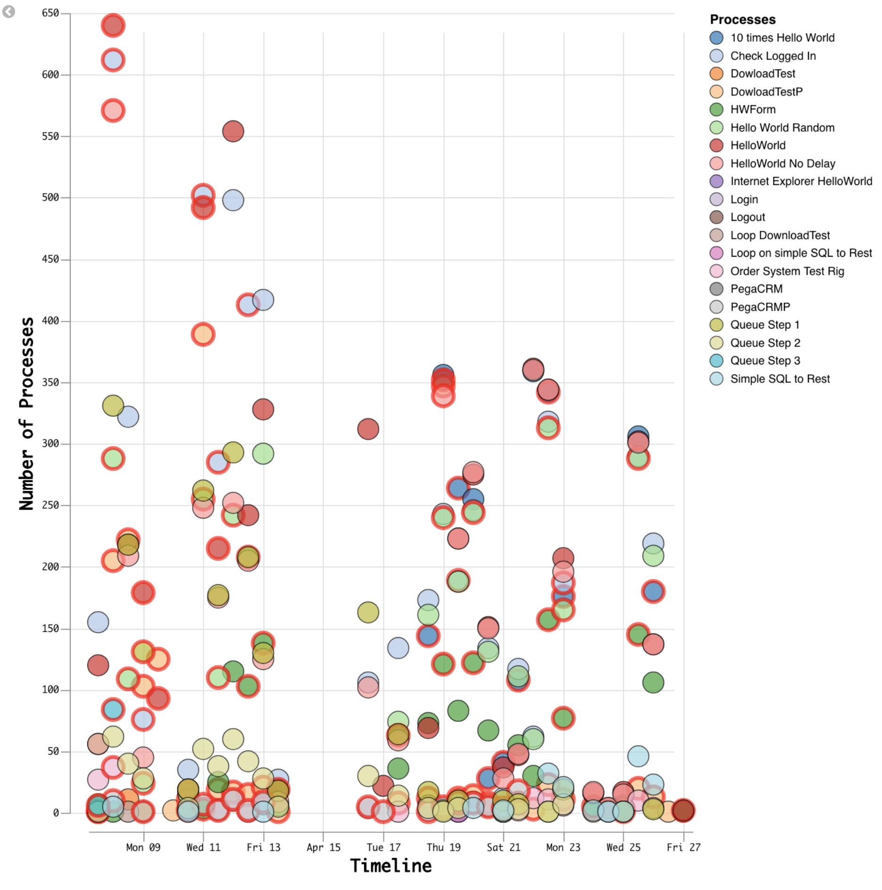
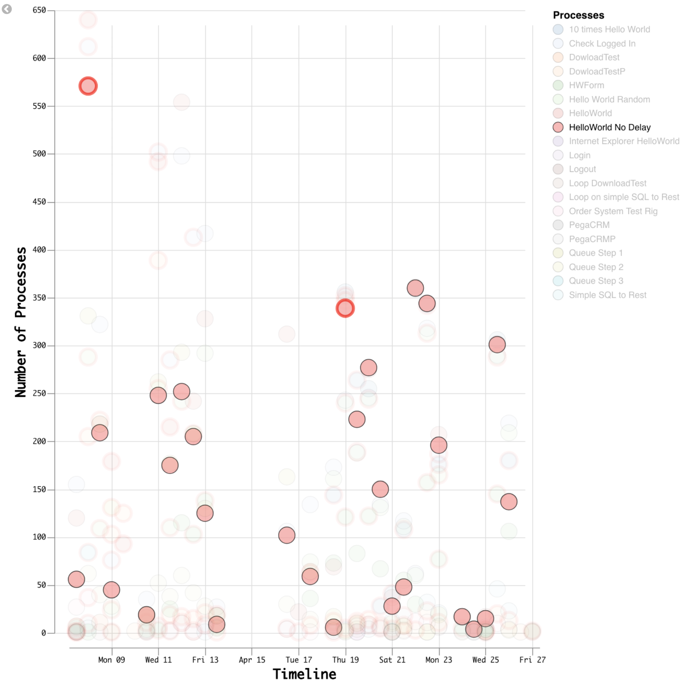

# Vega tutorial : complete example

here is the final product, you can see side by side when using the select option from the legend how it looks like:
Chart represent during the time range selected the number of process run, if an error occurs in one of the run included in the circle, a red crown will be added. This chart leverage the aggregation capacility of electic where a circle will aggregate the number of processes run during the interval reported.

<p float="left">


</p>


## Link the json to Vega

```javascript
  "$schema": "https://vega.github.io/schema/vega/v3.json",
```
Here is the data part :

```javascript
"data": [
    {
      "name": "points",
      "url": {
        "%context%": true,
        "%timefield%": "startdatetime",
        "index": "blueprism.process.completed*",
        "body": {
          "aggs": {
            "my_buckets": {
              "composite": {
                "size": 10000,
                "sources": [
                  {"processname": {"terms": {"field": "processprocessname.keyword", "order": "asc"}}},
                  {
                    "date": {
                      "date_histogram": {
                        "field": "startdatetime",
                        "interval": {"%autointerval%": true},
                        "order": "asc"
                      }
                    }
                  }
                ]
              },
              "aggregations": {
                "duration_avg": {"avg": {"field": "processduration"}},
                "seqnum": {"filter": {"term": {"seqnum": 1}}},
                "error": {
                  "filter": {
                    "query_string": {
                      "analyze_wildcard": true,
                      "default_field": "*",
                      "query": "result:\"?ERROR*\""
                    }
                  },
                  "aggs": {"Process_On_Error_count": {"cardinality": {"field": "sessionnumber"}}}
                },
                "Terminated": {
                  "filter": {"query_string": {"fields": ["status"], "query": "status:Terminated"}},
                  "aggs": {"Terminated_count": {"cardinality": {"field": "sessionnumber"}}}
                }
              }
            }
          }
        }
      },
      "format": {"type": "json", "property": "aggregations.my_buckets.buckets"},
      "transform": [
        {"type": "extent", "field": "key.date", "signal": "xext"},
        {"type": "extent", "field": "seqnum.doc_count", "signal": "yext"},
        {"type": "formula", "as": "recdate", "expr": "datum.key.date"},
        {"type": "formula", "as": "doc_count", "expr": "datum.seqnum.doc_count"}
      ]
    }
  ]
```

## Feeding the data into Vega

[Here](./vega-tutorial-navigate-data.md) is an easy way to get the basics on how to get the data into vega.


### Define the axis scale in relation to the data set
 

## Grid configuration

```javascript
 
"config": {
    "axis": {
        "grid": true, // true or false will show or hide the grid
        "tickSize": 10, //define the length of the tick on the axis
        "labelFont": "Monaco, Courier New",
        "titleFont" : "Monaco, Courier New",
        "titleFontSize": 18,
        "titlePadding" : 5 // define the distance between the title and the axis
  }
  ```


## Offset the axis and adding title

### Defining scales

In vega, scales have different purposes, it is mandatory to have scales attached to axis, however scales can be used to assign a color assigned to domain of values (e.g. if you want to color any catagory in the chart). Here under are three scales, the first two for the axis of the chart and the last one for the color that will be used in the chart. Scale are very often linked to data of the set.

```javascript
 "scales": [
    {
      "name": "xscale", // name of the scale, it can be anything, it serves as a reference for further
      "type": "utc", // Type of scale is utc meaning it is a time scale
      // the domain value of this scale if the field key.date coming from the data set
      "domain": {"data": "points", "field": "key.date"}, 
      // Range width defines this scale for the x axis
      "range": "width",
      "padding": 10 // leave some breathing space before representing the content on the sides
    },
    { // there is no type defined in this scale, the default value is linear
      "name": "yscale", // name of the scale, it can be anything, it serves as a reference for further
      // the domain value of this scale is the field seqnum.doc_count coming from the data set
      "domain": {"data": "points", "field": "seqnum.doc_count"}, 
      "nice": true, // will make sure the chart looks good as opposed to have the elements touching the edges
      // Range width defines this scale for the y axis
      "range": "height"
    },
    {
      "name": "color",
      "type": "ordinal",
      // the domain value of this scale is key.processname coming from the data set
      // it will map each value to a particular color, whenever the chart will represent that value,
      // it will use the color being mapped to it 
      "domain": {"data": "points", "field": "key.processname"},
      "range": {"scheme": "category20"}
    }
  ],
```

```json
# adding offset allows axis to bbe cleaner and not overlapping chart content
 axes": [
    {"scale": "xscale", "orient": "bottom", "offset": {"value": 20}, "title": "Timeline"},
    {"scale": "yscale", "orient": "left", "offset": {"value": 20}, "title": "Number of Processes"}
  ]
```

## Adding a Legend


```javascript
"legends": [
    {
      "fill": "color",
      "title": "Processes",
      "encode": {
        "title": {"update": {"fontSize": {"value": 14}}},
        "symbols": {
          "name": "legendSymbol",
          "interactive": true,
          "update": {
            "strokeWidth": {"value": 0.8},
            "stroke": {"value": "black"},
            "opacity": [
              {
                "test": "!length(data('selected')) || indata('selected', 'value', datum.value)",
                "value": 0.7
              },
              {"value": 0.15}
            ],
            "size": {"value": 194}
          }
        },
        "labels": {
          "name": "legendLabel",
          "interactive": true,
          "update": {
            "fontSize": {"value": 12},
            "fill": {"value": "black"},
            "opacity": [
              {
                "test": "!length(data('selected')) || indata('selected', 'value', datum.value)",
                "value": 1
              },
              {"value": 0.25}
            ]
          }
        }
      }
    }
  ],
```