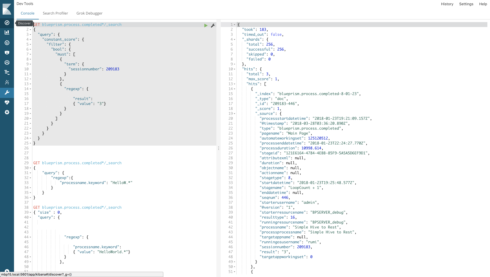

# Elastic Dev Tools - Console




## Search query and order

```
curl -XGET "http://<hostname>:9200/blueprism*/_search"

{
  "query": {
    "match_all": { }
  },
  "sort": [
    
    {
      "sessionnumber": {
        "order": "asc"
      }
    },
   {
      "seqnum": {
        "order": "asc"
      }
    },
    {
      "_index": {
        "order": "asc"
      }
    }
  ]
  
}
```


## Search Query and Filter

### simple filter to one single value

```
{
    "query" : {
        "constant_score" : { 
            "filter" : {
                "term" : { 
                    "sessionnumber" : 209183
                }
            }
        }
    }
}

```

### Search query `field1 == value1 AND field2 == value2`

```
{
  "query": {
    "constant_score": {
      "filter": {
        "bool": {
          "must": [
            {
              "term": {
                "sessionnumber": 209183
              }
            },
            {
              "term": {
                "seqnum": 2
              }
            }
          ]
        }
      }
    }
  }
}
```

#### lucene syntax filter

```
GET blueprism.process.completed*/_search
{
  "query": {
    "constant_score": {
      "filter": {
        "bool": {
          "must": [
            {
              "term": {
                "sessionnumber": 209183
              }
            },
            {
              "query_string": {
                "fields": [
                  "result"
                ],
                "query": "result:2"
              }
            }
          ]
        }
      }
    }
  }
}
```
going deeper, lucene syntax can be applied over several field, using the form as follow :

```
"query_string": {
                "fields": ["field1","field2"],
                "query": "<lucene query>"
              }


# with no argument specified, it will applied lucene over the whole set of fields available

GET /_search
{
    "query": {
        "query_string": {
            "query": "(content:this OR name:this) AND (content:that OR name:that)"
        }
    }
}
COPY AS CURLVIEW IN CONSOLE 


```


### RegEx syntax

```
GET blueprism.process.completed*/_search
{
  "query": {
    "constant_score": {
      "filter": {
        "bool": {
          "must": [
            
            {
              "regexp": {
              
                  "result":
                  { "value": "2."}
              }
            }
          ]
        }
      }
    }
  }
}

```


```
GET blueprism.process.completed*/_search
{
    "query": {
        "regexp":{
            "processname.keyword": "HelloW.*"
        }
    }
}

```


## Aggregation

### simple aggregation

```
{
    "aggs" : {
        "Stage" : {
            "terms" : { "field" : "stagename.keyword" }
        }
    }
}

```

returns

```
....

"aggregations": {
    "Stage": {
      "doc_count_error_upper_bound": 3736,
      "sum_other_doc_count": 170630,
      "buckets": [
        {
          "key": "Start",
          "doc_count": 225532
        },
        {
          "key": "End",
          "doc_count": 225426
        },
        {
          "key": "Navigate1",
          "doc_count": 34973
        },
        {
          "key": "Decrease Countdown",
          "doc_count": 22717
        },
        {
          "key": "Countdown < 1",
          "doc_count": 22571
        },
        {
          "key": "Navigate2",
          "doc_count": 20011
        },
        {
          "key": "Wait1",
          "doc_count": 17218
        },
        {
          "key": "Open Application",
          "doc_count": 12650
        },
        {
          "key": "Terminate Application",
          "doc_count": 12631
        },
        {
          "key": "Pause ",
          "doc_count": 12408
        }
      ]
    }
  }

```

```
GET blueprism.process.completed*/_search
{"size": 0, "aggs" : {
        "avg_grade" : { "avg" : { "field" : "duration" } }
    }
}
```
returns
```
{
  "took": 75,
  "timed_out": false,
  "_shards": {
    "total": 238,
    "successful": 238,
    "skipped": 0,
    "failed": 0
  },
  "hits": {
    "total": 6642898,
    "max_score": 0,
    "hits": []
  },
  "aggregations": {
    "avg_grade": {
      "value": 1.2980262566505631
    }
  }
}
```

```
GET blueprism.process.completed*/_search
{ "size" : 0
    "aggs" : {
        "Stage" : {
            "terms" : { "field" : "stagename.keyword" }
        },
        
        "duration": {
            "avg" : { "field" : "duration" }
        }
    }
}
```
returns

```
{
  "took": 133,
  "timed_out": false,
  "_shards": {
    "total": 238,
    "successful": 238,
    "skipped": 0,
    "failed": 0
  },
  "hits": {
    "total": 6642898,
    "max_score": 0,
    "hits": []
  },
  "aggregations": {
    "duration": {
      "value": 1.2980262566505631
    },
    "Stage": {
      "doc_count_error_upper_bound": 59656,
      "sum_other_doc_count": 1946684,
      "buckets": [
        {
          "key": "Start",
          "doc_count": 1881680
        },
        {
          "key": "End",
          "doc_count": 1869587
        },
        {
          "key": "Navigate1",
          "doc_count": 137802
        },
        {
          "key": "Should Raise Exception?",
          "doc_count": 116347
        },
        {
          "key": "Open",
          "doc_count": 116330
        },
        {
          "key": "Raise Exception If Appropriate",
          "doc_count": 116168
        },
        {
          "key": "Decrease Countdown",
          "doc_count": 95586
        },
        {
          "key": "Countdown < 1",
          "doc_count": 89495
        },
        {
          "key": "Navigate2",
          "doc_count": 80984
        },
        {
          "key": "Wait1",
          "doc_count": 74965
        }
      ]
    }
  }
}
```


### Aggregtion stats

```
curl -XGET "http://<hostname>:9200/blueprism.process.completed-2017.09.02/_search?pretty" -H 'Content-Type: application/json' -d'
{
    "size": 0,
    "aggs" : {
        "grades_stats" : { "extended_stats" : { "field" : "duration" } }
    }
}'

```

returns something like

```
{
  "took": 53,
  "timed_out": false,
  "_shards": {
    "total": 5,
    "successful": 5,
    "skipped": 0,
    "failed": 0
  },
  "hits": {
    "total": 800151,
    "max_score": 0,
    "hits": []
  },
  "aggregations": {
    "grades_stats": {
      "count": 134528,
      "min": 0,
      "max": 137.76400756835938,
      "avg": 0.9120795187238563,
      "sum": 122700.23349488294,
      "sum_of_squares": 647314.8421669485,
      "variance": 3.9798590052155007,
      "std_deviation": 1.9949583968633282,
      "std_deviation_bounds": {
        "upper": 4.901996312450513,
        "lower": -3.0778372750028002
      }
    }
  }
}


```


