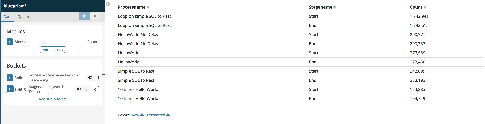
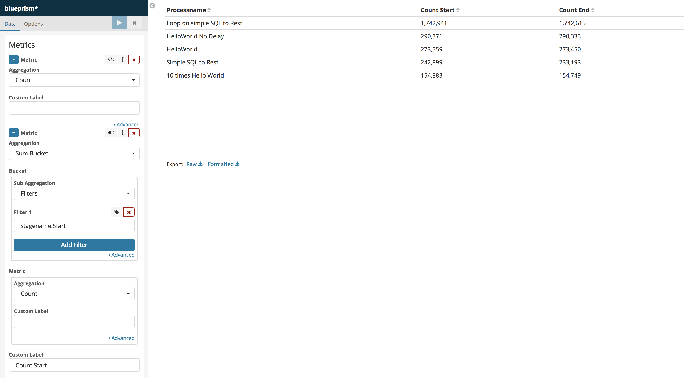
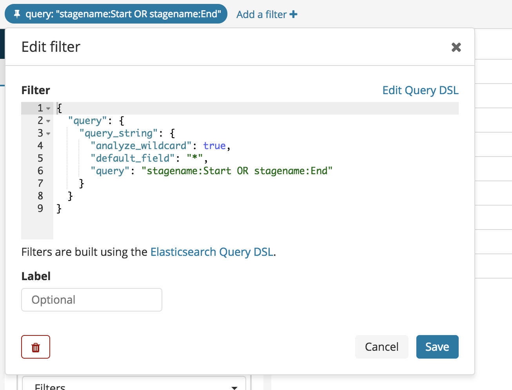
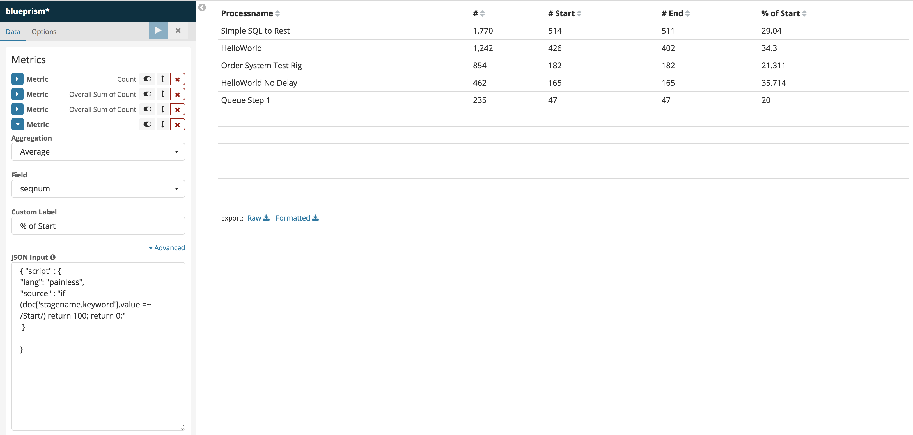

# Kibana use cases


## How to make column metrics aggregating on different data subset

Here is the question I have been concretely asked by one of my colleagues, I thought of documenting as it is easy when you know but when you dont know what to look for it becomes easy to waste an hour. Here is the problem, you have two fields one called *Processname* and the other one *Stagename*, assuming *Stagename* can take two value : *Start* and *End*. How can we put *Start* and *End* as column and have them highlighting the number of time they appear in the index.




Here are the steps:

***


- You need to create a first metric, in this case count all records in the data set.
- Then you create what is called in Kibana's terms *Sibling Pipeline Aggregations*, in this case we use aggregation sum bucket with a filter in lucene syntex `stagename:Start`, in other words we only take into account the count of the records having *Start* as *stagename* value.
- you repeat the same as before for *stagename* as *end* to add the corresponding metric.





Notes

****

1. The Metric at the very top has been disable/hidden from the display but it needs to be there as it is the *sibling pipeline*, without it nothing would be "pipelined" to the aggregation metrics.
2. Have a look to the filter here under that can help filtering the data really needed in the pipeline, it is not mandatory to make it work but in some cases, not removing noise data can generate undesired results.




To make sure to take records only for the *Start* and *End*

## How to display in Kibana the percentage between two columns or more.

If we take the previous example, the problem statement can be defined by "what is the percentage of *Start* comparing to *End*.
The simplest way is to use average function and a script like as follow :

> In this case we would like the percentage of message *Start* over the entire population. For that we need to average the result of the function that return the weight 100 whenever the message is *Start* and 0 otherwise.

```painless
{ "script" : {
"lang": "painless",
"source" : "if (doc['stagename.keyword'].value =~ /Start/) return 100; return 0;"
 }

}

```

Here is what the result is :




